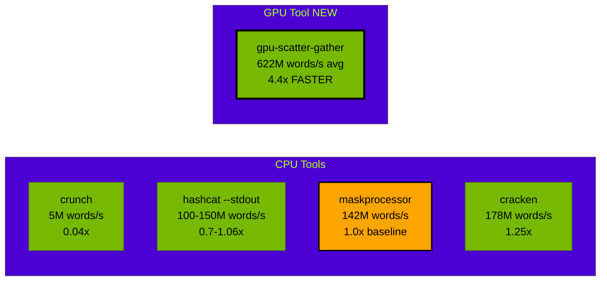
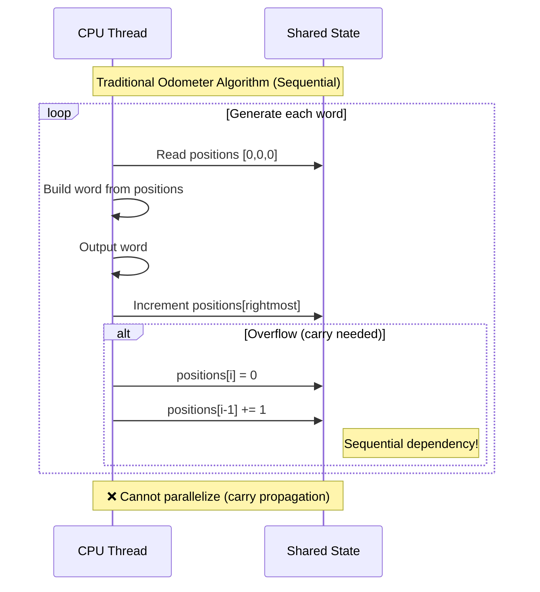
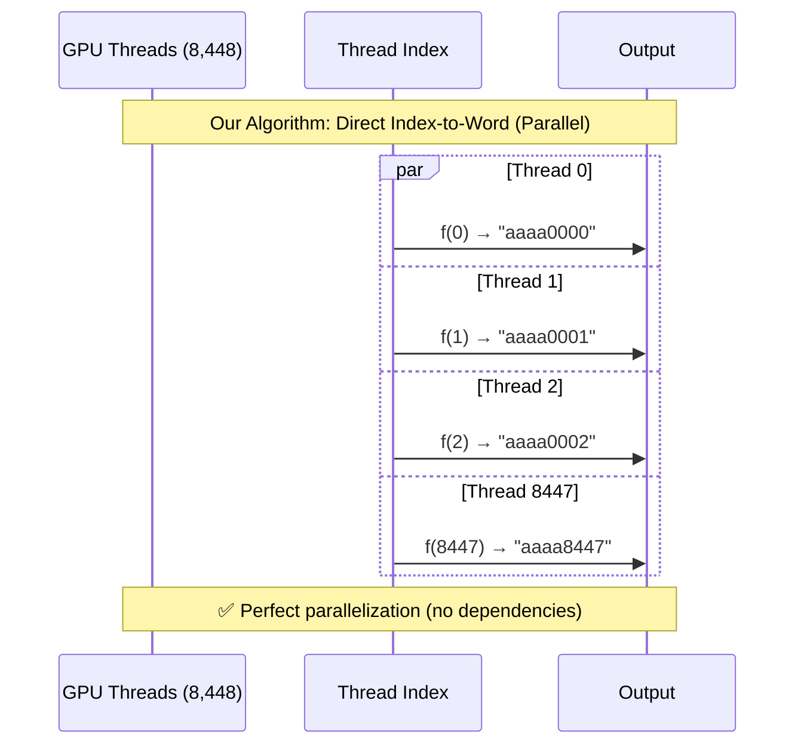
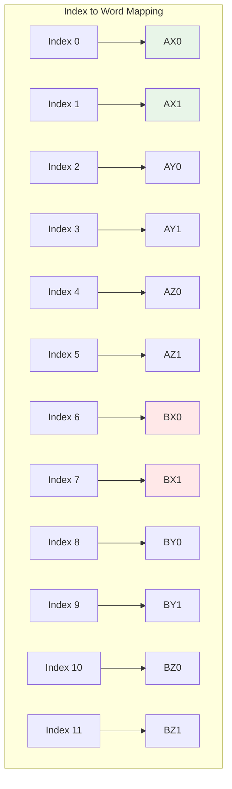
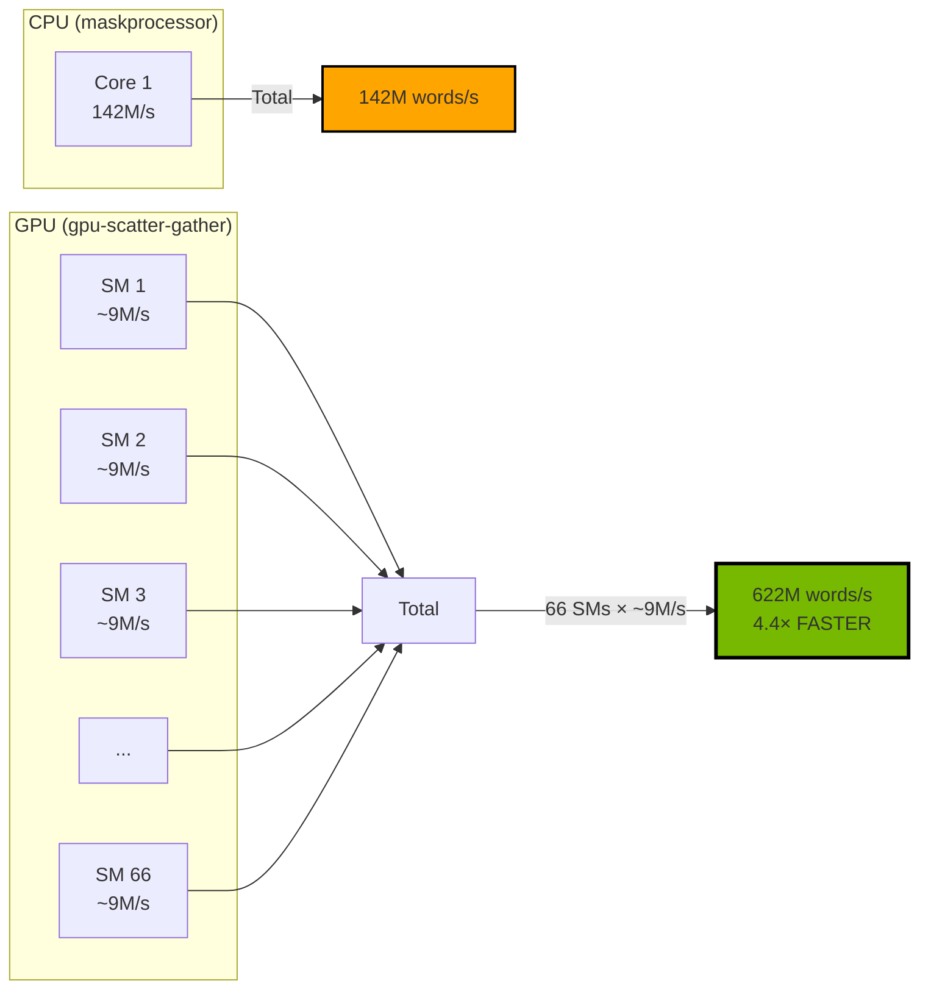
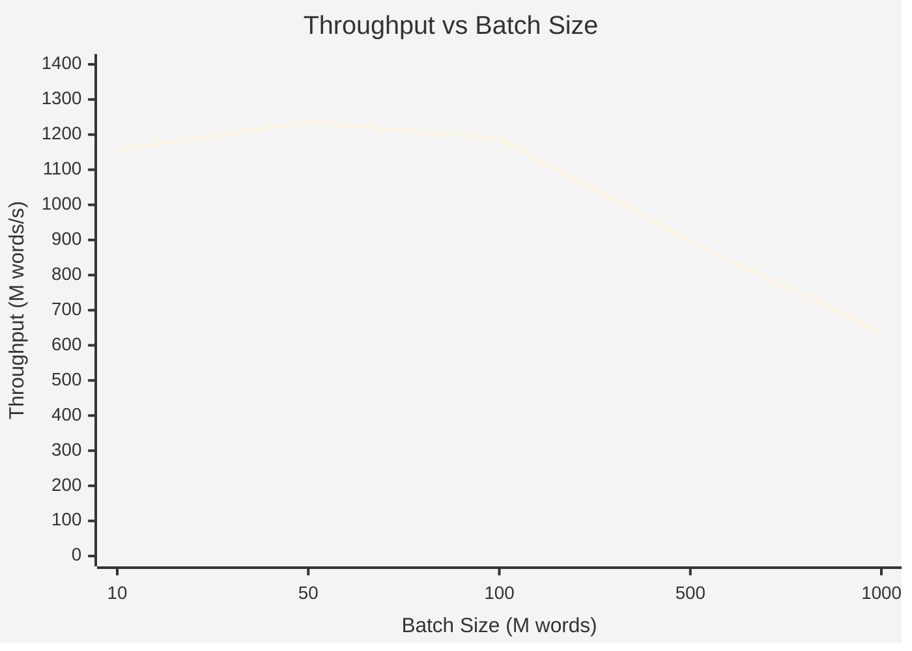
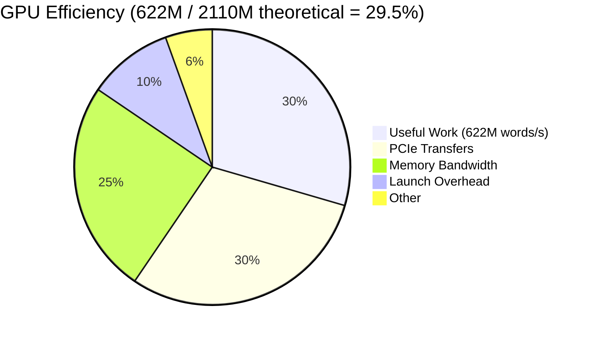
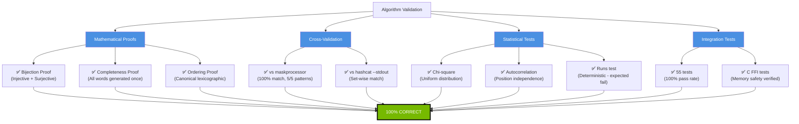
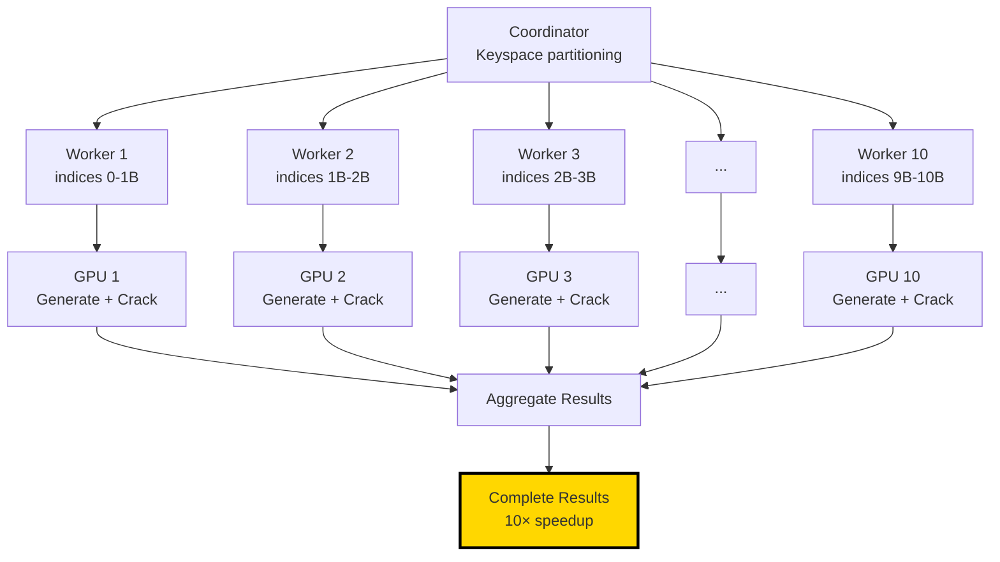

# Whitepaper Visualizations

**Purpose:** Visual elements for the technical whitepaper
**Format:** Mermaid diagrams (can be rendered in Markdown viewers and converted to images)

---

## 1. Performance Comparison Chart

### Throughput Comparison (Log Scale)



### Performance by Pattern (Bar Chart Data)

| Pattern | Throughput (M words/s) | Bar Visualization |
|---------|----------------------|-------------------|
| **6-char lowercase** | **725** | ████████████████████████████████████ (5.1× vs maskprocessor) |
| **Special chars** | **720** | ███████████████████████████████████▌ (5.1×) |
| **4-char lowercase** | **561** | ████████████████████████████ (3.9×) |
| **8-char lowercase** | **553** | ███████████████████████████▌ (3.9×) |
| **Mixed charsets** | **553** | ███████████████████████████▌ (3.9×) |
| maskprocessor (baseline) | 142 | ███████ (1.0×) |

---

## 2. System Architecture Diagram

```mermaid
flowchart TD
    subgraph App["Application Layer"]
        HC[hashcat]
        JTR[John the Ripper]
        PY[Python Script]
        CUSTOM[Custom Tool]
    end

    subgraph FFI["C FFI Layer (16 functions)"]
        HOST[Host API<br/>wg_create<br/>wg_generate<br/>wg_destroy]
        DEVICE[Device API<br/>wg_generate_device<br/>Zero-copy]
        FORMAT[Format Control<br/>Newlines/Packed/<br/>Fixed-width]
        STREAM[Streaming API<br/>Callbacks]
        UTIL[Utilities<br/>Keyspace size<br/>Error handling]
    end

    subgraph RUST["Rust Core Library (Safe API)"]
        WG[WordlistGenerator]
        CS[Charset Manager]
        MASK[Mask Parser]
        KS[Keyspace Calculator]
    end

    subgraph GPU["GPU Context (CUDA Driver API)"]
        MOD[Module Loader]
        KERN[Kernel Launcher]
        MEM[Memory Manager]
    end

    subgraph CUDA["CUDA Kernels (Multi-Architecture PTX)"]
        SM70[sm_70<br/>Turing]
        SM80[sm_80<br/>Ampere A100]
        SM86[sm_86<br/>Ampere RTX 30xx]
        SM89[sm_89<br/>Ada RTX 40xx]
        SM90[sm_90<br/>Hopper H100]
    end

    App --> FFI
    FFI --> RUST
    RUST --> GPU
    GPU --> CUDA

    style FFI fill:#4A90E2,stroke:#000,color:#fff
    style RUST fill:#CE422B,stroke:#000,color:#fff
    style GPU fill:#76B900,stroke:#000,color:#fff
    style CUDA fill:#000,stroke:#76B900,color:#fff,stroke-width:2px
```



---

## 3. Algorithm Comparison: Odometer vs Index-to-Word





---

## 4. Mixed-Radix Index-to-Word Visualization

### Example: 3-position mask with charsets [A,B] [X,Y,Z] [0,1]

**Keyspace size:** 2 × 3 × 2 = 12 words



**Algorithm for index 7 ("BX1"):**
```
remaining = 7

Position 2 (rightmost):
    charset = [0,1], size = 2
    char_idx = 7 % 2 = 1  →  '1'
    remaining = 7 / 2 = 3

Position 1 (middle):
    charset = [X,Y,Z], size = 3
    char_idx = 3 % 3 = 0  →  'X'
    remaining = 3 / 3 = 1

Position 0 (leftmost):
    charset = [A,B], size = 2
    char_idx = 1 % 2 = 1  →  'B'
    remaining = 1 / 2 = 0

Result: "BX1" ✓
```

---

## 5. GPU Parallelization Scaling



---

## 6. Batch Size Performance Analysis



**Interpretation:**
- **Peak at 50M words:** Best balance between GPU occupancy and PCIe overhead
- **Decline at 1B words:** PCIe transfer dominates (memory copy bottleneck)
- **Sweet spot:** 50-100M word batches

---

## 7. Efficiency Analysis



**Future Optimizations:**
- **Device pointer API:** Eliminate PCIe transfers → +30% efficiency
- **Barrett reduction:** Optimize divisions → +10% efficiency
- **Multi-GPU:** Linear scaling with more GPUs

---

## 8. Validation Results Summary



---

## 9. Competitive Positioning Matrix

| Feature | maskprocessor | cracken | hashcat | gpu-scatter-gather |
|---------|--------------|---------|---------|-------------------|
| **Throughput** | 142M/s | 178M/s | ~120M/s | **622M/s** ✅ |
| **GPU Acceleration** | ❌ | ❌ | Integrated only | ✅ Standalone |
| **Random Access (O(1))** | ❌ | ❌ | ❌ | ✅ Unique |
| **Programmatic API** | ❌ | ❌ | ❌ | ✅ C FFI |
| **Distributed Support** | Manual | Manual | Manual | ✅ Built-in |
| **Formal Proofs** | ❌ | ❌ | ❌ | ✅ Complete |
| **Language** | C | Rust | C | Rust + CUDA |
| **Open Source** | ✅ | ✅ | ✅ | ✅ |

**Legend:**
- ✅ = Full support
- ❌ = Not supported
- **Bold** = Best-in-class

---

## 10. Timeline: Development Milestones

```mermaid
timeline
    title GPU Scatter-Gather Development Timeline

    section Phase 1: Foundation
        October 2025 : CPU reference implementation
                     : Algorithm design (AI-proposed)
                     : CUDA kernel infrastructure
                     : POC validation (100% match)

    section Phase 2: Production Kernel
        November 2025 : Column-major kernel (2× faster)
                      : Memory optimization
                      : Scientific benchmarking
                      : Formal mathematical proofs
                      : Statistical validation

    section Phase 2.7: C API
        November 2025 : C FFI Layer (16 functions)
                      : Integration guides (hashcat, JtR)
                      : Documentation reorganization
                      : v1.0.0 Release ✅

    section Future
        2026 : Device pointer API (2-3× faster)
             : Multi-GPU support
             : Language bindings (Python, JS, Go)
             : Alternative backends (OpenCL, Metal)
```

---

## 11. Use Case Flow Diagrams

### Use Case 1: Hashcat Integration (Pipe)


### Use Case 2: Distributed Cracking



---

## 12. Memory Layout: Column-Major Optimization

### Before: Row-Major (Uncoalesced)

```
Thread 0: word0[0] word0[1] word0[2] ... word0[7] \n
Thread 1: word1[0] word1[1] word1[2] ... word1[7] \n
Thread 2: word2[0] word2[1] word2[2] ... word2[7] \n
...

Memory access pattern:
T0: [addr+0]  T1: [addr+9]  T2: [addr+18]  <- Non-contiguous! ❌
```

### After: Column-Major (Coalesced)

```
Position 0: word0[0] word1[0] word2[0] ... word8447[0]
Position 1: word0[1] word1[1] word2[1] ... word8447[1]
Position 2: word0[2] word1[2] word2[2] ... word8447[2]
...

Memory access pattern:
T0: [addr+0]  T1: [addr+1]  T2: [addr+2]  <- Contiguous! ✅
```

**Performance:** 2× faster due to coalesced writes!

---

## Notes for PDF Conversion

**Mermaid Rendering:**
1. Use **mermaid-cli** to convert diagrams to PNG/SVG:
   ```bash
   npm install -g @mermaid-js/mermaid-cli
   mmdc -i diagram.mmd -o diagram.png -b transparent
   ```

2. Or use **online tools:**
   - https://mermaid.live/
   - https://mermaid.ink/

3. For **Pandoc conversion to PDF:**
   ```bash
   # Install mermaid filter
   npm install -g mermaid-filter

   # Convert with mermaid support
   pandoc WHITEPAPER.md \
     -o WHITEPAPER.pdf \
     --filter mermaid-filter \
     -V geometry:margin=1in \
     --pdf-engine=xelatex
   ```

**Alternative: Manual approach**
1. Render all Mermaid diagrams to PNG
2. Replace Mermaid code blocks with `` in Markdown
3. Convert to PDF with Pandoc

---

**Document Version:** 1.0
**Last Updated:** November 21, 2025
